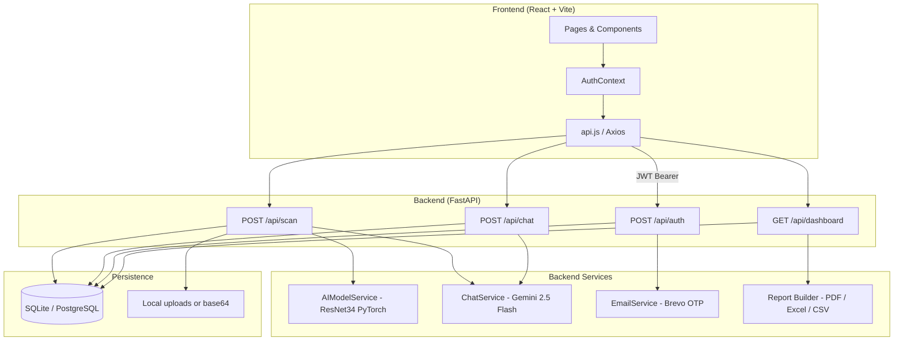
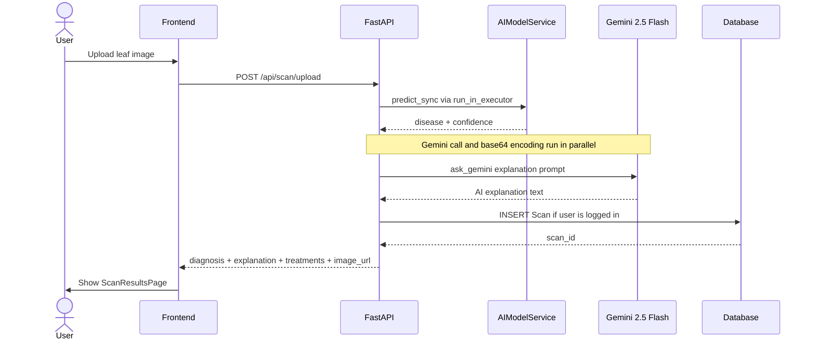
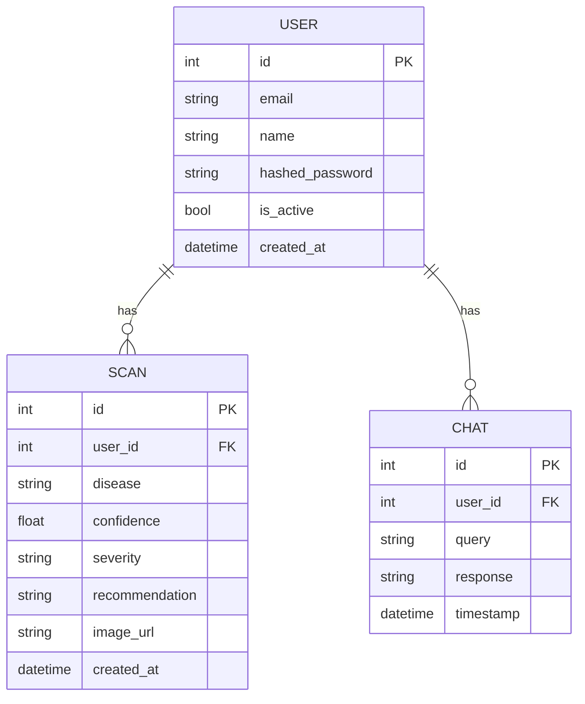
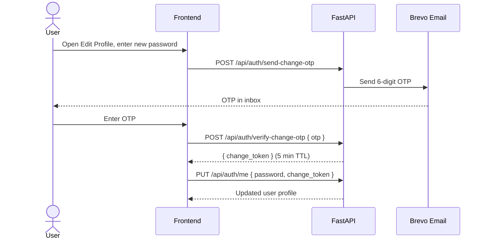

# AgroSight

AI-powered plant disease detection platform. Upload a photo of a plant leaf and get an instant diagnosis, treatment recommendations, and an AI explanation — all backed by a ResNet34 model trained on 38 disease classes.

---

## What it does

- Detects 38 plant diseases from a leaf photo using a fine-tuned ResNet34 model
- Generates a natural-language explanation via Google Gemini 2.5 Flash
- Provides organic and chemical treatment options per disease
- Saves scan history to a database when the user is logged in
- AI chat assistant for open-ended agricultural questions
- Dashboard with real stats (total scans, diseases detected, healthy %, accuracy)
- Export scan reports as PDF, Excel, or CSV
- OTP-based password change flow via email (Brevo)

---
    
## Tech stack

**Frontend**
- React 19 + Vite 8
- Tailwind CSS v3
- React Router v7
- Axios

**Backend**
- FastAPI + Uvicorn
- SQLAlchemy (async) + aiosqlite / asyncpg
- Alembic migrations
- JWT authentication (python-jose + passlib)
- Google Gemini 2.5 Flash (AI explanations + chat)
- Brevo (email OTP)
- ReportLab + openpyxl (PDF/Excel export)

**ML**
- PyTorch + torchvision
- ResNet34 fine-tuned on PlantVillage dataset
- 38 disease classes across 14 crop types
- Async inference via `run_in_executor`

---

## Project structure

```
agrosight/
├── backend/
│   ├── app/
│   │   ├── api/routes/       # auth, scan, chat, dashboard
│   │   ├── core/             # config, security
│   │   ├── db/               # session, migrations
│   │   ├── models/           # SQLAlchemy models
│   │   ├── schemas/          # Pydantic schemas
│   │   ├── services/         # ai_model, chat_service, email_service
│   │   └── main.py
│   ├── ml/
│   │   ├── data/             # raw + processed datasets
│   │   ├── saved_models/     # trained .pth + class_names.json
│   │   └── training/         # train.py
│   ├── requirements.txt
│   └── Dockerfile
├── frontend/
│   ├── src/
│   │   ├── components/       # SideNavBar, TopAppBar, BottomNavBar
│   │   ├── context/          # AuthContext
│   │   ├── pages/            # all page components
│   │   └── services/         # api.js (axios)
│   ├── package.json
│   └── Dockerfile
└── docker-compose.yml
```

---

## Architecture



---

## Scan flow



---

## Database schema



---

## Auth flow (OTP password change)



---

## Local setup

### Prerequisites

- Python 3.11+
- Node.js 18+
- A trained model file at `backend/ml/saved_models/resnet34_plant_disease_best.pth`
- `class_names.json` at `backend/ml/saved_models/class_names.json`

### Backend

```bash
cd backend
python -m venv venv
venv\Scripts\activate        # Windows
# source venv/bin/activate   # Linux/Mac

pip install -r requirements.txt

cp .env.example .env
# Edit .env — set SECRET_KEY, GEMINI_API_KEY, BREVO_API_KEY

uvicorn app.main:app --reload
```

API runs at `http://localhost:8000`. Docs at `http://localhost:8000/docs`.

### Frontend

```bash
cd frontend
npm install

# Create .env.local
echo "VITE_API_URL=http://localhost:8000" > .env.local

npm run dev
```

App runs at `http://localhost:5173`.

---

## Environment variables

Copy `backend/.env.example` to `backend/.env` and fill in:

| Variable | Required | Description |
|---|---|---|
| `SECRET_KEY` | yes | JWT signing key — generate with `python -c "import secrets; print(secrets.token_hex(32))"` |
| `DATABASE_URL` | yes | SQLite (`sqlite+aiosqlite:///./agrosight.db`) or PostgreSQL |
| `GEMINI_API_KEY` | yes | Google AI Studio API key |
| `BREVO_API_KEY` | no | Brevo (Sendinblue) key for OTP emails |
| `MODEL_PATH` | yes | Path to `.pth` model file |
| `CLASS_NAMES_PATH` | yes | Path to `class_names.json` |
| `FRONTEND_URL` | yes | CORS origin (`http://localhost:5173` in dev) |
| `CONFIDENCE_THRESHOLD` | no | Min confidence to trust prediction (default `0.7`) |

---

## API endpoints

```
POST   /api/auth/register          Register new user
POST   /api/auth/login             Login, returns JWT
GET    /api/auth/me                Get current user
PUT    /api/auth/me                Update profile (name, email, password)
DELETE /api/auth/me                Delete account
POST   /api/auth/send-change-otp   Send OTP to email before password change
POST   /api/auth/verify-change-otp Verify OTP, returns change_token
POST   /api/auth/forgot-password   Request password reset OTP
POST   /api/auth/reset-password    Reset password with token

POST   /api/scan/upload            Upload image, returns diagnosis
GET    /api/scan/history           Get user's scan history
GET    /api/scan/{id}              Get single scan
DELETE /api/scan/{id}              Delete scan

POST   /api/chat/ask               Send message, get AI response
GET    /api/chat/history           Get chat history
DELETE /api/chat/history           Clear chat history

GET    /api/dashboard/stats        Get aggregate stats
GET    /api/dashboard/report/download?format=pdf|excel|csv
```

---

## Docker

```bash
docker-compose up --build
```

- Backend: `http://localhost:8000`
- Frontend: `http://localhost:80`

Make sure to set environment variables in `docker-compose.yml` or via a `.env` file before running in production.

---

## ML model

The model is a ResNet34 fine-tuned on the PlantVillage dataset. It classifies 38 conditions across crops including tomato, potato, apple, corn, grape, pepper, and more.

To train your own:

```bash
cd backend
python ml/training/train.py
```

The trained weights go to `ml/saved_models/resnet34_plant_disease_best.pth` and the class list to `ml/saved_models/class_names.json`.

---

## Supported diseases

The model detects 38 conditions across 14 crops (26 diseases + 12 healthy classes).

### Apple — 4 classes

| Class | Description |
|---|---|
| Apple Scab | Fungal disease (*Venturia inaequalis*) causing dark, scabby lesions on leaves and fruit. Spreads rapidly in cool, wet spring weather. |
| Black Rot | Caused by *Botryosphaeria obtusa*. Produces brown leaf spots with purple borders and mummified fruit. Can kill entire branches. |
| Cedar Apple Rust | Fungal disease (*Gymnosporangium juniperi-virginianae*) requiring two hosts — apple and cedar/juniper. Creates bright orange-yellow spots on leaves. |
| Healthy | No disease detected. |

### Blueberry — 1 class

| Class | Description |
|---|---|
| Healthy | No disease detected. |

### Cherry — 2 classes

| Class | Description |
|---|---|
| Powdery Mildew | Caused by *Podosphaera clandestina*. White powdery coating on young leaves and shoots. Stunts growth and reduces fruit quality. |
| Healthy | No disease detected. |

### Corn (Maize) — 4 classes

| Class | Description |
|---|---|
| Cercospora Leaf Spot / Gray Leaf Spot | Caused by *Cercospora zeae-maydis*. Rectangular gray-tan lesions running parallel to leaf veins. One of the most yield-limiting diseases in maize. |
| Common Rust | Caused by *Puccinia sorghi*. Small, powdery, brick-red pustules on both leaf surfaces. Spreads fast in cool, humid conditions. |
| Northern Leaf Blight | Caused by *Exserohilum turcicum*. Long, cigar-shaped gray-green lesions. Severe infections can cause significant yield loss. |
| Healthy | No disease detected. |

### Grape — 4 classes

| Class | Description |
|---|---|
| Black Rot | Caused by *Guignardia bidwellii*. Brown leaf lesions with black borders and shriveled, mummified berries. Thrives in warm, wet weather. |
| Esca (Black Measles) | Complex fungal disease involving multiple pathogens. Causes tiger-stripe leaf patterns and internal wood decay. Can kill vines over time. |
| Leaf Blight (Isariopsis Leaf Spot) | Caused by *Pseudocercospora vitis*. Dark brown angular spots on older leaves, leading to early defoliation and weakened vines. |
| Healthy | No disease detected. |

### Orange — 1 class

| Class | Description |
|---|---|
| Huanglongbing (Citrus Greening) | Caused by *Candidatus Liberibacter* bacteria spread by the Asian citrus psyllid. Produces blotchy, asymmetric yellowing. Incurable — infected trees must be removed. |

### Peach — 2 classes

| Class | Description |
|---|---|
| Bacterial Spot | Caused by *Xanthomonas arboricola*. Water-soaked spots on leaves that turn brown and fall out, leaving a shot-hole appearance. Also affects fruit. |
| Healthy | No disease detected. |

### Pepper (Bell) — 2 classes

| Class | Description |
|---|---|
| Bacterial Spot | Caused by *Xanthomonas campestris*. Small, water-soaked lesions on leaves and fruit that turn brown and scabby. Spreads through rain splash. |
| Healthy | No disease detected. |

### Potato — 3 classes

| Class | Description |
|---|---|
| Early Blight | Caused by *Alternaria solani*. Dark brown concentric ring lesions (target-board pattern) on older leaves. Reduces photosynthesis and tuber yield. |
| Late Blight | Caused by *Phytophthora infestans* — the same pathogen behind the Irish Potato Famine. Water-soaked lesions that rapidly turn brown-black. Extremely destructive. |
| Healthy | No disease detected. |

### Raspberry — 1 class

| Class | Description |
|---|---|
| Healthy | No disease detected. |

### Soybean — 1 class

| Class | Description |
|---|---|
| Healthy | No disease detected. |

### Squash — 1 class

| Class | Description |
|---|---|
| Powdery Mildew | Caused by *Podosphaera xanthii* or *Erysiphe cichoracearum*. White powdery patches on leaves and stems. Reduces photosynthesis and fruit quality. |

### Strawberry — 2 classes

| Class | Description |
|---|---|
| Leaf Scorch | Caused by *Diplocarpon earlianum*. Small, dark purple spots that enlarge and merge, giving leaves a scorched appearance. Weakens plants over multiple seasons. |
| Healthy | No disease detected. |

### Tomato — 10 classes

| Class | Description |
|---|---|
| Bacterial Spot | Caused by *Xanthomonas* spp. Small, water-soaked spots with yellow halos on leaves and dark, raised spots on fruit. Spreads through rain and irrigation. |
| Early Blight | Caused by *Alternaria solani*. Dark concentric ring lesions on older leaves, starting from the bottom of the plant upward. |
| Late Blight | Caused by *Phytophthora infestans*. Irregular, greasy-looking dark lesions on leaves and stems. Can destroy an entire crop within days in wet conditions. |
| Leaf Mold | Caused by *Passalora fulva*. Yellow patches on upper leaf surface with olive-green mold on the underside. Common in high-humidity greenhouses. |
| Septoria Leaf Spot | Caused by *Septoria lycopersici*. Numerous small circular spots with dark borders and light centers. Causes rapid defoliation from the bottom up. |
| Spider Mites / Two-Spotted Spider Mite | Caused by *Tetranychus urticae*. Tiny mites cause stippled, bronzed leaves and fine webbing. Thrives in hot, dry conditions. |
| Target Spot | Caused by *Corynespora cassiicola*. Concentric ring lesions resembling a target on leaves, stems, and fruit. Favored by warm, humid weather. |
| Yellow Leaf Curl Virus | Transmitted by whiteflies (*Bemisia tabaci*). Causes severe leaf curling, yellowing, and stunted growth. No cure — infected plants must be removed. |
| Tomato Mosaic Virus | Caused by *Tomato mosaic virus (ToMV)*. Produces mosaic-patterned light and dark green patches on leaves. Spreads through contact and contaminated tools. |
| Healthy | No disease detected. |

---

## Pages

| Route | Description |
|---|---|
| `/` | Landing page |
| `/login` | Login |
| `/register` | Register |
| `/dashboard` | Stats overview + recent scans + export |
| `/scan` | Upload plant image |
| `/scan/results` | Diagnosis result + AI explanation + inline chat |
| `/scan/:id` | View saved scan |
| `/history` | Full scan history with filters |
| `/chat` | AI chat assistant |
| `/profile` | Edit profile, change password (OTP), delete account |
