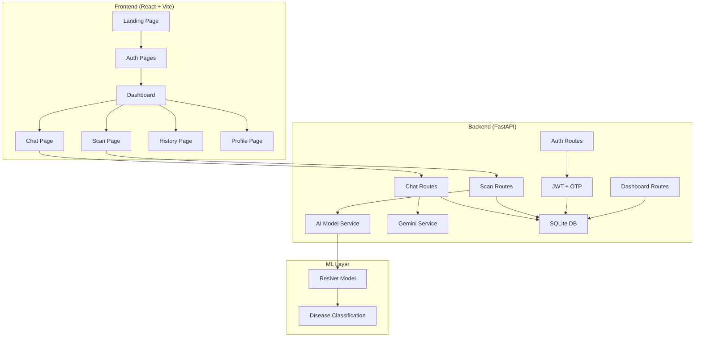
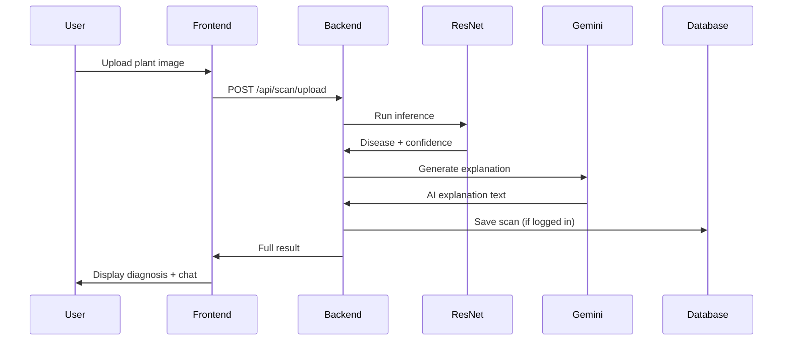

# AgroSight - AI-Powered Plant Disease Detection

> A full-stack web application that uses deep learning to identify plant diseases from images, providing farmers with instant diagnosis, treatment recommendations, and an AI chat assistant.

**Technologies:** Python 3.11 | FastAPI | React 18 | PyTorch | Google Gemini | SQLite

---

## Overview

AgroSight is a production-ready web application that leverages AI and computer vision to detect plant diseases. Users upload plant images and receive real-time disease predictions with confidence scores, treatment recommendations, and AI-generated explanations. A built-in chat assistant powered by Google Gemini provides ongoing agricultural advice.

### Key Features

- Image-based plant disease detection using a trained ResNet CNN
- Google Gemini AI for disease explanations and chat assistance
- User authentication with JWT and OTP-verified password changes
- Scan history saved per user with delete support
- Chat history persisted to database per user
- Analytics dashboard with scan statistics
- Responsive UI with mobile bottom nav and desktop sidebar

---

## System Architecture



---

## Application Flow



---

## Technology Stack

### Frontend
- **React 18** — Component-based UI
- **Vite** — Build tool and dev server
- **Tailwind CSS v3** — Utility-first styling
- **React Router v6** — Client-side routing
- **Axios** — HTTP client
- **Context API** — Auth state management

### Backend
- **FastAPI** — Python web framework
- **SQLAlchemy (async)** — ORM
- **Alembic** — Database migrations
- **Pydantic** — Data validation
- **PyJWT + Passlib** — Auth and security
- **Google Gemini API** — AI chat and explanations

### Machine Learning
- **PyTorch** — Deep learning framework
- **Torchvision / ResNet** — CNN architecture
- **Pillow** — Image preprocessing

### Database
- **SQLite** — Development (file-based)
- **PostgreSQL** — Production (Docker)

---

## Project Structure

```
agrosight/
│
├── backend/
│   ├── app/
│   │   ├── api/
│   │   │   ├── deps.py                  # Auth dependency injection
│   │   │   └── routes/
│   │   │       ├── auth.py              # Register, login, OTP, profile
│   │   │       ├── scan.py              # Upload, history, delete
│   │   │       ├── chat.py              # Ask, history, clear
│   │   │       └── dashboard.py         # Stats
│   │   ├── core/
│   │   │   ├── config.py                # App settings
│   │   │   └── security.py              # JWT utilities
│   │   ├── models/
│   │   │   ├── user.py
│   │   │   ├── scan.py
│   │   │   └── chat.py
│   │   ├── schemas/
│   │   │   ├── user.py
│   │   │   ├── scan.py
│   │   │   └── chat.py
│   │   ├── services/
│   │   │   ├── ai_model.py              # ResNet inference
│   │   │   ├── chat_service.py          # Gemini integration
│   │   │   ├── disease_info.py          # Treatment data
│   │   │   └── email_service.py         # OTP email
│   │   └── db/
│   │       ├── base.py
│   │       ├── session.py
│   │       └── migrations/
│   │
│   ├── ml/
│   │   ├── training/train.py
│   │   ├── utils/preprocessing.py
│   │   ├── data/
│   │   └── saved_models/
│   │
│   ├── requirements.txt
│   ├── alembic.ini
│   └── .env
│
├── frontend/
│   ├── src/
│   │   ├── pages/
│   │   │   ├── LandingPage.jsx
│   │   │   ├── LoginPage.jsx
│   │   │   ├── RegisterPage.jsx
│   │   │   ├── DashboardPage.jsx
│   │   │   ├── ScanPage.jsx
│   │   │   ├── ScanResultsPage.jsx
│   │   │   ├── HistoryPage.jsx
│   │   │   ├── ChatPage.jsx
│   │   │   └── ProfilePage.jsx
│   │   ├── components/
│   │   │   ├── SideNavBar.jsx
│   │   │   ├── BottomNavBar.jsx
│   │   │   ├── TopAppBar.jsx
│   │   │   └── ProtectedRoute.jsx
│   │   ├── services/
│   │   │   └── api.js
│   │   └── context/
│   │       └── AuthContext.jsx
│   │
│   ├── package.json
│   └── vite.config.js
│
├── docker-compose.yml
├── .gitignore
└── README.md
```

---

## Installation and Setup

### Prerequisites

- Python 3.11+
- Node.js 18+
- Git

### Backend Setup

```bash
git clone https://github.com/chandu1234678/AgroSight.git
cd AgroSight/backend

python -m venv venv
# Windows
.\venv\Scripts\activate
# macOS/Linux
source venv/bin/activate

pip install -r requirements.txt
alembic upgrade head
uvicorn app.main:app --reload --host 0.0.0.0 --port 8000
```

API available at `http://localhost:8000` — docs at `http://localhost:8000/docs`

### Frontend Setup

```bash
cd frontend
npm install
npm run dev
```

App available at `http://localhost:5173`

---

## Environment Variables

Create `backend/.env`:

```env
DATABASE_URL=sqlite:///./agrosight.db

SECRET_KEY=your-secret-key-here
ALGORITHM=HS256
ACCESS_TOKEN_EXPIRE_MINUTES=30

GEMINI_API_KEY=your-gemini-api-key

# Email (for OTP)
SMTP_HOST=smtp.gmail.com
SMTP_PORT=587
SMTP_USER=your@email.com
SMTP_PASSWORD=your-app-password

MODEL_PATH=ml/saved_models/resnet_plant_disease.pth
CLASS_NAMES_PATH=ml/saved_models/class_names.json
```

---

## API Endpoints

### Authentication
| Method | Endpoint | Description |
|--------|----------|-------------|
| POST | `/api/auth/register` | Create account |
| POST | `/api/auth/login` | Get JWT token |
| GET | `/api/auth/me` | Current user info |
| PUT | `/api/auth/me` | Update profile |
| DELETE | `/api/auth/me` | Delete account |
| POST | `/api/auth/send-change-otp` | Send OTP for password change |
| POST | `/api/auth/verify-change-otp` | Verify OTP, get change token |
| POST | `/api/auth/forgot-password` | Request reset OTP |
| POST | `/api/auth/reset-password` | Reset with token |

### Scan
| Method | Endpoint | Description |
|--------|----------|-------------|
| POST | `/api/scan/upload` | Upload image, get diagnosis |
| GET | `/api/scan/history` | User scan history |
| GET | `/api/scan/{id}` | Single scan details |
| DELETE | `/api/scan/{id}` | Delete scan |

### Chat
| Method | Endpoint | Description |
|--------|----------|-------------|
| POST | `/api/chat/ask` | Ask AI assistant |
| GET | `/api/chat/history` | Chat history |
| DELETE | `/api/chat/history` | Clear all history |

### Dashboard
| Method | Endpoint | Description |
|--------|----------|-------------|
| GET | `/api/dashboard/stats` | User statistics |

---

## Docker Deployment

```bash
docker-compose up --build
```

Starts backend (8000), frontend (5173), and PostgreSQL (5432).

---

## Troubleshooting

**Port 8000 in use:**
```bash
# Windows
netstat -ano | findstr :8000
taskkill /PID <PID> /F
```

**Database errors:**
```bash
rm backend/agrosight.db
cd backend && alembic upgrade head
```

**Frontend module errors:**
```bash
cd frontend
rm -rf node_modules package-lock.json
npm install
```

---

## Acknowledgments

- PlantVillage dataset for training data
- PyTorch team for the deep learning framework
- Google Gemini for AI capabilities
- FastAPI community
