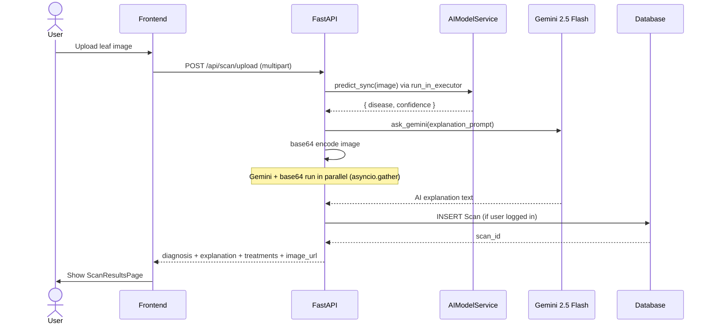
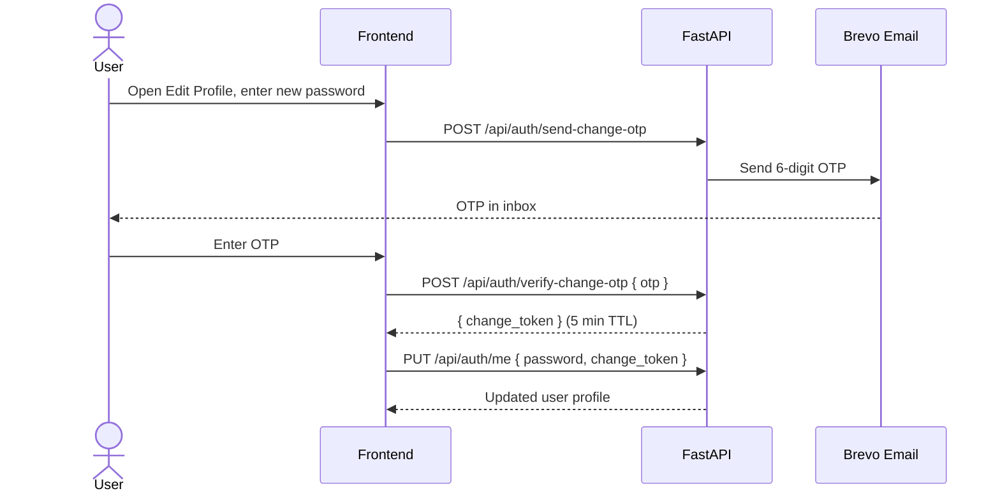

# AgroSight

AI-powered plant disease detection platform. Upload a photo of a plant leaf and get an instant diagnosis, treatment recommendations, and an AI explanation — all backed by a ResNet34 model trained on 38 disease classes.

---

## What it does

- Detects 38 plant diseases from a leaf photo using a fine-tuned ResNet34 model
- Generates a natural-language explanation via Google Gemini 2.5 Flash
- Provides organic and chemical treatment options per disease
- Saves scan history to a database when the user is logged in
- AI chat assistant for open-ended agricultural questions
- Dashboard with real stats (total scans, diseases detected, healthy %, accuracy)
- Export scan reports as PDF, Excel, or CSV
- OTP-based password change flow via email (Brevo)

---

## Tech stack

**Frontend**
- React 19 + Vite 8
- Tailwind CSS v3
- React Router v7
- Axios

**Backend**
- FastAPI + Uvicorn
- SQLAlchemy (async) + aiosqlite / asyncpg
- Alembic migrations
- JWT authentication (python-jose + passlib)
- Google Gemini 2.5 Flash (AI explanations + chat)
- Brevo (email OTP)
- ReportLab + openpyxl (PDF/Excel export)

**ML**
- PyTorch + torchvision
- ResNet34 fine-tuned on PlantVillage dataset
- 38 disease classes across 14 crop types
- Async inference via `run_in_executor`

---

## Project structure

```
agrosight/
├── backend/
│   ├── app/
│   │   ├── api/routes/       # auth, scan, chat, dashboard
│   │   ├── core/             # config, security
│   │   ├── db/               # session, migrations
│   │   ├── models/           # SQLAlchemy models
│   │   ├── schemas/          # Pydantic schemas
│   │   ├── services/         # ai_model, chat_service, email_service
│   │   └── main.py
│   ├── ml/
│   │   ├── data/             # raw + processed datasets
│   │   ├── saved_models/     # trained .pth + class_names.json
│   │   └── training/         # train.py
│   ├── requirements.txt
│   └── Dockerfile
├── frontend/
│   ├── src/
│   │   ├── components/       # SideNavBar, TopAppBar, BottomNavBar
│   │   ├── context/          # AuthContext
│   │   ├── pages/            # all page components
│   │   └── services/         # api.js (axios)
│   ├── package.json
│   └── Dockerfile
└── docker-compose.yml
```

---

## Architecture

```mermaid
graph TB
    subgraph Client["Frontend (React + Vite)"]
        UI[Pages & Components]
        AC[AuthContext]
        API[api.js / Axios]
    end

    subgraph Server["Backend (FastAPI)"]
        AUTH[/api/auth]
        SCAN[/api/scan]
        CHAT[/api/chat]
        DASH[/api/dashboard]
    end

    subgraph Services["Backend Services"]
        AIM[AIModelService<br/>ResNet34 · PyTorch]
        GEM[ChatService<br/>Gemini 2.5 Flash]
        EMAIL[EmailService<br/>Brevo OTP]
        REPORT[Report Builder<br/>PDF · Excel · CSV]
    end

    subgraph Storage["Persistence"]
        DB[(SQLite / PostgreSQL<br/>SQLAlchemy async)]
        FS[Local uploads<br/>or base64 in DB]
    end

    UI --> AC --> API
    API -->|JWT Bearer| AUTH
    API --> SCAN
    API --> CHAT
    API --> DASH

    SCAN --> AIM
    SCAN --> GEM
    SCAN --> DB
    SCAN --> FS

    CHAT --> GEM
    CHAT --> DB

    AUTH --> EMAIL
    AUTH --> DB

    DASH --> DB
    DASH --> REPORT
```

---

## Scan flow



---

## Database schema


---

## Auth flow (OTP password change)



---

## Local setup

### Prerequisites

- Python 3.11+
- Node.js 18+
- A trained model file at `backend/ml/saved_models/resnet34_plant_disease_best.pth`
- `class_names.json` at `backend/ml/saved_models/class_names.json`

### Backend

```bash
cd backend
python -m venv venv
venv\Scripts\activate        # Windows
# source venv/bin/activate   # Linux/Mac

pip install -r requirements.txt

cp .env.example .env
# Edit .env — set SECRET_KEY, GEMINI_API_KEY, BREVO_API_KEY

uvicorn app.main:app --reload
```

API runs at `http://localhost:8000`. Docs at `http://localhost:8000/docs`.

### Frontend

```bash
cd frontend
npm install

# Create .env.local
echo "VITE_API_URL=http://localhost:8000" > .env.local

npm run dev
```

App runs at `http://localhost:5173`.

---

## Environment variables

Copy `backend/.env.example` to `backend/.env` and fill in:

| Variable | Required | Description |
|---|---|---|
| `SECRET_KEY` | yes | JWT signing key — generate with `python -c "import secrets; print(secrets.token_hex(32))"` |
| `DATABASE_URL` | yes | SQLite (`sqlite+aiosqlite:///./agrosight.db`) or PostgreSQL |
| `GEMINI_API_KEY` | yes | Google AI Studio API key |
| `BREVO_API_KEY` | no | Brevo (Sendinblue) key for OTP emails |
| `MODEL_PATH` | yes | Path to `.pth` model file |
| `CLASS_NAMES_PATH` | yes | Path to `class_names.json` |
| `FRONTEND_URL` | yes | CORS origin (`http://localhost:5173` in dev) |
| `CONFIDENCE_THRESHOLD` | no | Min confidence to trust prediction (default `0.7`) |

---

## API endpoints

```
POST   /api/auth/register          Register new user
POST   /api/auth/login             Login, returns JWT
GET    /api/auth/me                Get current user
PUT    /api/auth/me                Update profile (name, email, password)
DELETE /api/auth/me                Delete account
POST   /api/auth/send-change-otp   Send OTP to email before password change
POST   /api/auth/verify-change-otp Verify OTP, returns change_token
POST   /api/auth/forgot-password   Request password reset OTP
POST   /api/auth/reset-password    Reset password with token

POST   /api/scan/upload            Upload image, returns diagnosis
GET    /api/scan/history           Get user's scan history
GET    /api/scan/{id}              Get single scan
DELETE /api/scan/{id}              Delete scan

POST   /api/chat/ask               Send message, get AI response
GET    /api/chat/history           Get chat history
DELETE /api/chat/history           Clear chat history

GET    /api/dashboard/stats        Get aggregate stats
GET    /api/dashboard/report/download?format=pdf|excel|csv
```

---

## Docker

```bash
docker-compose up --build
```

- Backend: `http://localhost:8000`
- Frontend: `http://localhost:80`

Make sure to set environment variables in `docker-compose.yml` or via a `.env` file before running in production.

---

## ML model

The model is a ResNet34 fine-tuned on the PlantVillage dataset. It classifies 38 conditions across crops including tomato, potato, apple, corn, grape, pepper, and more.

To train your own:

```bash
cd backend
python ml/training/train.py
```

The trained weights go to `ml/saved_models/resnet34_plant_disease_best.pth` and the class list to `ml/saved_models/class_names.json`.

---

## Pages

| Route | Description |
|---|---|
| `/` | Landing page |
| `/login` | Login |
| `/register` | Register |
| `/dashboard` | Stats overview + recent scans + export |
| `/scan` | Upload plant image |
| `/scan/results` | Diagnosis result + AI explanation + inline chat |
| `/scan/:id` | View saved scan |
| `/history` | Full scan history with filters |
| `/chat` | AI chat assistant |
| `/profile` | Edit profile, change password (OTP), delete account |
