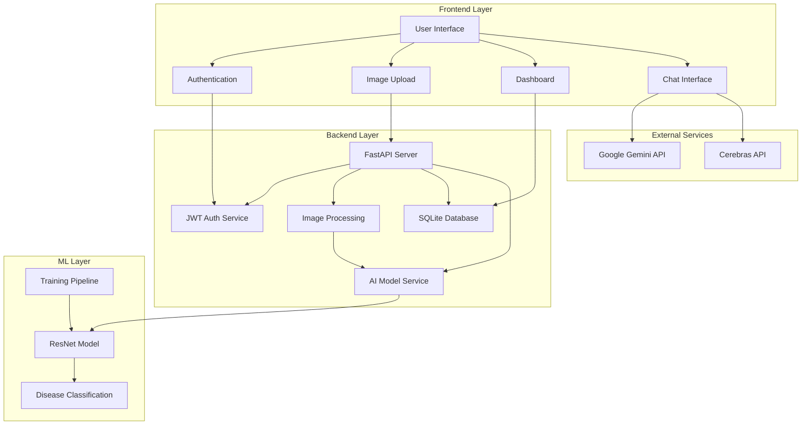
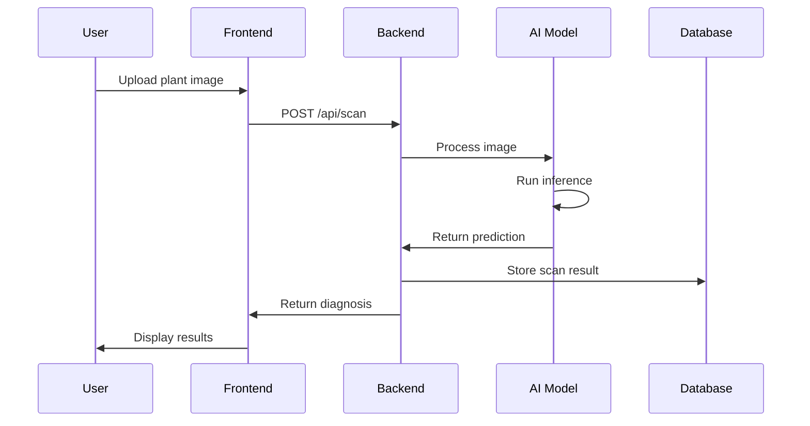
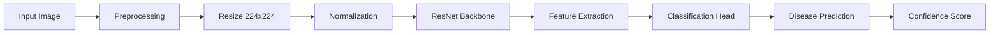
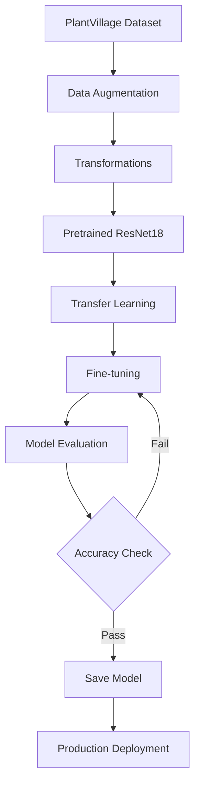

# AgroSight - AI-Powered Plant Disease Detection

> A full-stack web application that uses deep learning to identify plant diseases from images, providing farmers with instant diagnosis and treatment recommendations.

**Technologies:** Python 3.11 | FastAPI 0.104 | React 18.2 | PyTorch 2.1

---

## Overview

AgroSight is a production-ready web application that leverages artificial intelligence and computer vision to detect plant diseases. The system allows users to upload plant images and receive real-time disease predictions with confidence scores and treatment recommendations.

### Key Features

- Image-based plant disease detection using ResNet CNN
- User authentication and authorization with JWT
- Real-time AI chat assistant for agricultural advice
- Historical scan tracking and analytics dashboard
- RESTful API with comprehensive documentation
- Responsive web interface built with React

---

## System Architecture



---

## Application Flow



---

## Technology Stack

### Frontend
- **React 18.2** - Component-based UI library
- **Vite** - Build tool and development server
- **Axios** - HTTP client for API communication
- **React Router** - Client-side routing
- **Context API** - State management

### Backend
- **FastAPI** - Modern Python web framework
- **SQLAlchemy** - SQL toolkit and ORM
- **Alembic** - Database migration tool
- **Pydantic** - Data validation using Python type hints
- **Passlib & JWT** - Authentication and security

### Machine Learning
- **PyTorch** - Deep learning framework
- **Torchvision** - Computer vision library
- **ResNet** - Convolutional neural network architecture
- **PIL/Pillow** - Image processing

### Database
- **SQLite** - Development database
- **PostgreSQL** - Production database (Docker)

---

## Project Structure

```
agrosight/
│
├── backend/
│   ├── app/
│   │   ├── api/
│   │   │   ├── deps.py
│   │   │   └── routes/
│   │   │       ├── auth.py          # Authentication endpoints
│   │   │       ├── scan.py          # Disease detection endpoints
│   │   │       ├── chat.py          # Chat assistant endpoints
│   │   │       └── dashboard.py     # Analytics endpoints
│   │   ├── core/
│   │   │   ├── config.py            # Application configuration
│   │   │   └── security.py          # Security utilities
│   │   ├── models/
│   │   │   ├── user.py              # User database model
│   │   │   ├── scan.py              # Scan database model
│   │   │   └── chat.py              # Chat database model
│   │   ├── schemas/
│   │   │   ├── user.py              # User Pydantic schemas
│   │   │   ├── scan.py              # Scan Pydantic schemas
│   │   │   └── chat.py              # Chat Pydantic schemas
│   │   ├── services/
│   │   │   ├── ai_model.py          # ML inference service
│   │   │   ├── chat_service.py      # Chat integration service
│   │   │   └── storage_service.py   # File storage service
│   │   └── db/
│   │       ├── base.py              # Database base configuration
│   │       ├── session.py           # Database session management
│   │       └── migrations/          # Alembic migrations
│   │
│   ├── ml/
│   │   ├── models/
│   │   │   └── resnet_model.py      # ResNet architecture
│   │   ├── training/
│   │   │   ├── train.py             # Training script
│   │   │   └── evaluate.py          # Evaluation script
│   │   ├── utils/
│   │   │   ├── preprocessing.py     # Data preprocessing
│   │   │   └── augmentations.py     # Data augmentation
│   │   ├── data/                    # Training datasets
│   │   └── saved_models/            # Trained model files
│   │
│   ├── requirements.txt
│   ├── alembic.ini
│   └── .env
│
├── frontend/
│   ├── src/
│   │   ├── pages/
│   │   │   ├── Login.jsx
│   │   │   ├── Signup.jsx
│   │   │   ├── Dashboard.jsx
│   │   │   ├── Scan.jsx
│   │   │   ├── History.jsx
│   │   │   └── Chat.jsx
│   │   ├── components/
│   │   │   ├── Navbar.jsx
│   │   │   ├── Sidebar.jsx
│   │   │   ├── UploadCard.jsx
│   │   │   └── PrivateRoute.jsx
│   │   ├── services/
│   │   │   └── api.js               # API client
│   │   ├── context/
│   │   │   └── AuthContext.jsx      # Authentication context
│   │   └── main.jsx
│   │
│   ├── package.json
│   └── vite.config.js
│
├── docker-compose.yml
├── .gitignore
├── README.md
└── SETUP.md
```

---

## Installation and Setup

### Prerequisites

- Python 3.11 or higher
- Node.js 18 or higher
- Git

### Backend Setup

1. Clone the repository:
```bash
git clone https://github.com/chandu1234678/AgroSight.git
cd AgroSight
```

2. Navigate to backend directory:
```bash
cd backend
```

3. Create and activate virtual environment:
```bash
# Windows
python -m venv venv
.\venv\Scripts\activate

# macOS/Linux
python3 -m venv venv
source venv/bin/activate
```

4. Install dependencies:
```bash
pip install -r requirements.txt
```

5. Run database migrations:
```bash
alembic upgrade head
```

6. Start the backend server:
```bash
uvicorn app.main:app --reload --host 0.0.0.0 --port 8000
```

The backend API will be available at `http://localhost:8000`  
API documentation: `http://localhost:8000/docs`

### Frontend Setup

1. Open a new terminal and navigate to frontend directory:
```bash
cd frontend
```

2. Install dependencies:
```bash
npm install
```

3. Start the development server:
```bash
npm run dev
```

The frontend application will be available at `http://localhost:5173`

---

## Machine Learning Pipeline

### Model Architecture



### Training Pipeline



### Data Augmentation Techniques

- Random rotation (±15 degrees)
- Horizontal and vertical flips
- Random brightness and contrast adjustment
- Gaussian noise injection
- Motion blur simulation
- Random cropping and scaling

---

## Configuration

### Environment Variables

Create a `.env` file in the `backend/` directory:

```env
# Database Configuration
DATABASE_URL=sqlite:///./agrosight.db

# Security
SECRET_KEY=your-secret-key-here
ALGORITHM=HS256
ACCESS_TOKEN_EXPIRE_MINUTES=30

# External APIs (Optional)
GEMINI_API_KEY=your-gemini-api-key
CEREBRAS_API_KEY=your-cerebras-api-key

# Storage (Optional)
CLOUDINARY_URL=your-cloudinary-url

# ML Model Configuration
MODEL_PATH=ml/saved_models/resnet_plant_disease.pth
CLASS_NAMES_PATH=ml/saved_models/class_names.json
```

---

## API Endpoints

### Authentication
- `POST /api/auth/signup` - User registration
- `POST /api/auth/login` - User login
- `GET /api/auth/me` - Get current user

### Disease Detection
- `POST /api/scan` - Upload image for disease detection
- `GET /api/scan/{scan_id}` - Get scan details
- `GET /api/scan/history` - Get user scan history

### Dashboard
- `GET /api/dashboard/stats` - Get user statistics

### Chat Assistant
- `POST /api/chat` - Send message to AI assistant
- `GET /api/chat/history` - Get chat history

---

## Docker Deployment

Run the entire application stack using Docker Compose:

```bash
docker-compose up --build
```

This will start:
- Backend API (port 8000)
- Frontend application (port 5173)
- PostgreSQL database (port 5432)

---

## Testing

### Backend Tests
```bash
cd backend
pytest
```

### Frontend Tests
```bash
cd frontend
npm test
```

---

## Technical Concepts

### Transfer Learning
The application uses transfer learning by leveraging a pre-trained ResNet model trained on ImageNet. The final classification layer is replaced and fine-tuned on plant disease datasets, significantly reducing training time and improving accuracy.

### JWT Authentication
JSON Web Tokens (JWT) are used for stateless authentication. Upon successful login, users receive a token that must be included in subsequent API requests via the Authorization header.

### REST API Design
The backend follows RESTful principles with proper HTTP methods (GET, POST, PUT, DELETE), status codes, and resource-based URLs for intuitive API interaction.

---

## Troubleshooting

### Backend Issues

**Port already in use:**
```bash
# Find and kill process on port 8000
# Windows
netstat -ano | findstr :8000
taskkill /PID <PID> /F

# macOS/Linux
lsof -ti:8000 | xargs kill -9
```

**Database migration errors:**
```bash
# Reset database
rm agrosight.db
alembic upgrade head
```

### Frontend Issues

**Module not found errors:**
```bash
# Clear cache and reinstall
rm -rf node_modules package-lock.json
npm install
```

**Build errors:**
```bash
# Clear Vite cache
rm -rf node_modules/.vite
npm run dev
```

---

## Contributing

Contributions are welcome. Please follow these steps:

1. Fork the repository
2. Create a feature branch (`git checkout -b feature/new-feature`)
3. Commit your changes (`git commit -m 'Add new feature'`)
4. Push to the branch (`git push origin feature/new-feature`)
5. Open a Pull Request

---

## Learning Resources

- [FastAPI Documentation](https://fastapi.tiangolo.com/)
- [React Documentation](https://react.dev/)
- [PyTorch Tutorials](https://pytorch.org/tutorials/)
- [Transfer Learning Guide](https://pytorch.org/tutorials/beginner/transfer_learning_tutorial.html)
- [PlantVillage Dataset](https://www.kaggle.com/datasets/emmarex/plantdisease)

---

## License

This project is licensed under the MIT License - see the LICENSE file for details.

---

## Author

**Chandu**  
GitHub: [@chandu1234678](https://github.com/chandu1234678)  
Project: [AgroSight](https://github.com/chandu1234678/AgroSight)

---

## Acknowledgments

- PlantVillage dataset for training data
- PyTorch team for the deep learning framework
- FastAPI community for the excellent web framework
