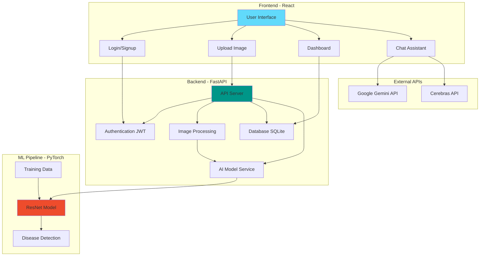
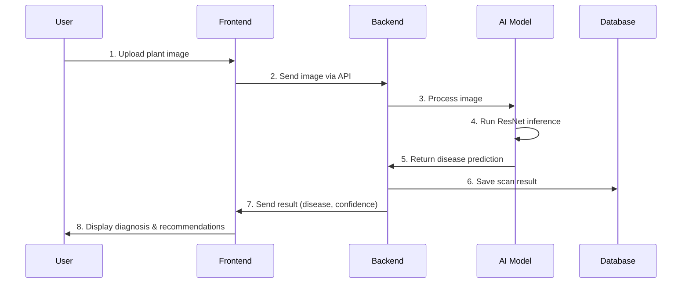
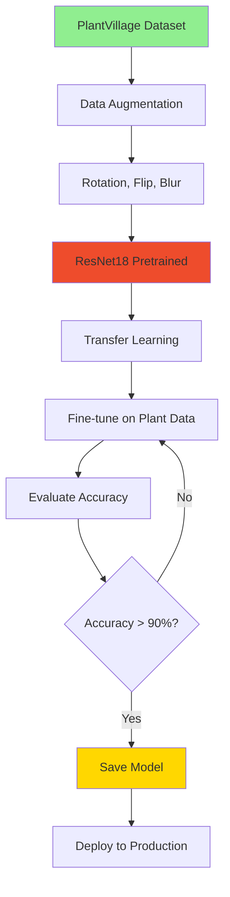

# 🌾 AgroSight - AI-Powered Plant Disease Detection

> A smart web application that helps farmers identify plant diseases by simply uploading a photo! Built with AI/ML for accurate detection and helpful recommendations.

[](https://www.python.org/)
[](https://fastapi.tiangolo.com/)
[](https://reactjs.org/)
[](https://pytorch.org/)

---

## 🎯 What is AgroSight?

AgroSight is a **full-stack web application** that uses **Artificial Intelligence** to detect plant diseases from images. Farmers can:
- 📸 Upload a photo of their plant
- 🤖 Get instant AI-powered disease detection
- 💡 Receive treatment recommendations
- 💬 Chat with an AI assistant for farming advice
- 📊 Track their scan history on a dashboard

---

## 🏗️ System Architecture



---

## 🔄 How It Works - User Flow



---

## �️ Tech Stack Explained

### Frontend (What Users See)
- **React** - Modern JavaScript library for building user interfaces
- **Vite** - Super fast build tool for development
- **Axios** - Makes API calls to backend
- **Tailwind CSS** - Beautiful, responsive styling

### Backend (The Brain)
- **FastAPI** - Python web framework (super fast & easy to use)
- **SQLAlchemy** - Talks to the database
- **Alembic** - Manages database changes
- **JWT** - Secure user authentication (like a digital ID card)

### AI/ML (The Intelligence)
- **PyTorch** - Deep learning framework
- **ResNet** - Pre-trained neural network (transfer learning)
- **Torchvision** - Image processing tools

### Database
- **SQLite** - Simple database for development
- **PostgreSQL** - Powerful database for production

---

## 📁 Project Structure

```
agrosight/
│
├── backend/                    # Python backend server
│   ├── app/
│   │   ├── api/               # API endpoints (routes)
│   │   │   └── routes/
│   │   │       ├── auth.py    # Login/Signup
│   │   │       ├── scan.py    # Image upload & detection
│   │   │       ├── chat.py    # AI chat assistant
│   │   │       └── dashboard.py
│   │   ├── core/              # Configuration & security
│   │   ├── models/            # Database models (User, Scan, Chat)
│   │   ├── schemas/           # Data validation
│   │   ├── services/          # Business logic
│   │   │   ├── ai_model.py    # AI inference
│   │   │   ├── chat_service.py
│   │   │   └── storage_service.py
│   │   └── db/                # Database setup
│   │
│   ├── ml/                    # Machine Learning pipeline
│   │   ├── models/            # ResNet architecture
│   │   ├── training/          # Train & evaluate
│   │   ├── data/              # Training datasets
│   │   └── saved_models/      # Trained model files
│   │
│   ├── requirements.txt       # Python dependencies
│   ├── alembic.ini           # Database migration config
│   └── .env                  # Environment variables
│
├── frontend/                  # React frontend
│   ├── src/
│   │   ├── pages/            # Main pages
│   │   │   ├── Login.jsx
│   │   │   ├── Signup.jsx
│   │   │   ├── Dashboard.jsx
│   │   │   ├── Scan.jsx      # Upload & detect
│   │   │   ├── History.jsx
│   │   │   └── Chat.jsx
│   │   ├── components/       # Reusable UI components
│   │   ├── services/         # API calls
│   │   └── context/          # Global state (auth)
│   │
│   ├── package.json          # Node dependencies
│   └── vite.config.js        # Build configuration
│
├── docker-compose.yml        # Run everything with Docker
├── .gitignore               # Files to ignore in Git
├── README.md                # You are here!
└── SETUP.md                 # Detailed setup guide
```

---

## 🚀 Quick Start Guide

### Prerequisites (What You Need Installed)

1. **Python 3.11+** - [Download here](https://www.python.org/downloads/)
2. **Node.js 18+** - [Download here](https://nodejs.org/)
3. **Git** - [Download here](https://git-scm.com/)

### Step 1: Clone the Repository

```bash
git clone https://github.com/chandu1234678/AgroSight.git
cd AgroSight
```

### Step 2: Setup Backend (Python)

```bash
# Navigate to backend folder
cd backend

# Create virtual environment (isolated Python environment)
python -m venv venv

# Activate virtual environment
# On Windows:
.\venv\Scripts\activate
# On Mac/Linux:
source venv/bin/activate

# Install Python packages
pip install -r requirements.txt

# Setup database
alembic upgrade head

# Start backend server
uvicorn app.main:app --reload --host 0.0.0.0 --port 8000
```

✅ Backend is now running at: **http://localhost:8000**  
📚 API Documentation: **http://localhost:8000/docs**

### Step 3: Setup Frontend (React)

Open a **new terminal** window:

```bash
# Navigate to frontend folder
cd frontend

# Install Node packages
npm install

# Start development server
npm run dev
```

✅ Frontend is now running at: **http://localhost:5173**

### Step 4: Open in Browser

Visit **http://localhost:5173** and start using AgroSight! 🎉

---

## 📊 ML Pipeline - How the AI Works

```mermaid
graph LR
    A[Plant Image] --> B[Preprocessing]
    B --> C[Resize to 224x224]
    C --> D[Normalize Pixels]
    D --> E[ResNet Model]
    E --> F[Feature Extraction]
    F --> G[Classification Layer]
    G --> H[Disease Prediction]
    H --> I[Confidence Score]
    
    style A fill:#90EE90
    style E fill:#ee4c2c
    style H fill:#FFD700
```



### Training Pipeline



---

## 🔐 Environment Variables

Create a `.env` file in the `backend/` folder:

```env
# Database
DATABASE_URL=sqlite:///./agrosight.db

# Security
SECRET_KEY=your-super-secret-key-here-change-this
ALGORITHM=HS256
ACCESS_TOKEN_EXPIRE_MINUTES=30

# AI APIs (Optional - for chat features)
GEMINI_API_KEY=your-gemini-api-key
CEREBRAS_API_KEY=your-cerebras-api-key

# Storage (Optional - for cloud image storage)
CLOUDINARY_URL=your-cloudinary-url

# ML Model Paths
MODEL_PATH=ml/saved_models/resnet_plant_disease.pth
CLASS_NAMES_PATH=ml/saved_models/class_names.json
```

---

## 🎓 For Students - Learning Resources

### What You'll Learn

1. **Full-Stack Development**
   - Frontend: React components, state management, routing
   - Backend: REST APIs, authentication, database operations

2. **Machine Learning**
   - Transfer learning with PyTorch
   - Image classification with CNNs
   - Model training and evaluation

3. **DevOps**
   - Docker containerization
   - Environment management
   - Git version control

### Key Concepts

**Transfer Learning**: Instead of training from scratch, we use a pre-trained ResNet model (trained on millions of images) and fine-tune it for plant diseases. This saves time and improves accuracy!

**JWT Authentication**: JSON Web Tokens are like digital ID cards. When you login, you get a token that proves who you are for future requests.

**REST API**: A way for frontend and backend to communicate using HTTP requests (GET, POST, PUT, DELETE).

---

## 🐳 Docker Deployment (Advanced)

Run everything with one command:

```bash
docker-compose up --build
```

This starts:
- Backend API (port 8000)
- Frontend (port 5173)
- PostgreSQL database (port 5432)

---

## 📸 Screenshots

### Dashboard


### Disease Detection


### Chat Assistant


---

## 🤝 Contributing

We welcome contributions! Here's how:

1. Fork the repository
2. Create a new branch (`git checkout -b feature/amazing-feature`)
3. Make your changes
4. Commit (`git commit -m 'Add amazing feature'`)
5. Push (`git push origin feature/amazing-feature`)
6. Open a Pull Request

---

## 🐛 Troubleshooting

### Backend won't start?
- Make sure virtual environment is activated
- Check if port 8000 is already in use
- Verify all dependencies are installed: `pip list`

### Frontend won't start?
- Delete `node_modules` and run `npm install` again
- Check if port 5173 is available
- Clear npm cache: `npm cache clean --force`

### Database errors?
- Delete `agrosight.db` and run `alembic upgrade head` again
- Check database URL in `.env` file

---

## 📚 Additional Resources

- [FastAPI Documentation](https://fastapi.tiangolo.com/)
- [React Documentation](https://react.dev/)
- [PyTorch Tutorials](https://pytorch.org/tutorials/)
- [PlantVillage Dataset](https://www.kaggle.com/datasets/emmarex/plantdisease)

---

## 📝 License

MIT License - feel free to use this project for learning!

---

## 👨‍💻 Author

**Chandu**  
GitHub: [@chandu1234678](https://github.com/chandu1234678)  
Project Link: [AgroSight](https://github.com/chandu1234678/AgroSight)

---

## ⭐ Show Your Support

If this project helped you learn something new, give it a ⭐️ on GitHub!

**Connect with me:**
- 💼 LinkedIn: [Add your LinkedIn]
- 📧 Email: [Add your email]

---

**Made with ❤️ for farmers and students learning AI/ML**
